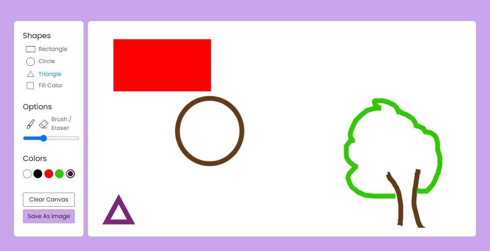

# DrawingDoodle
The project is built using HTML, CSS, and JavaScript. Where you can Draw your Designs and save those designs in image form!!

### Visit Project at
<a href="https://ambersultan.github.io/drawingDoodle/ ">https://ambersultan.github.io/drawingDoodle/ </a>

## Features
<ul>
    <li><b>Brush Selection:</b> Choose from a variety of brushes for different strokes and effects.</li>
    <li><b>Color Palette:</b> Access a wide range of colors and customize your own palette for easy selection.</li>
    <li><b>Clear Canvas:</b> Clear the canvas to start fresh or remove unwanted elements from your artwork.</li>
    <li><b>Save Image:</b> Save your masterpiece in various image formats to your device or cloud storage.</li>
</ul>

## Screenshots

## Technologies Used
<ul>
    <li><b>HTML5:</b> Markup language for structuring the webpage.</li>
    <li><b>CSS3:</b> Styling language for enhancing the visual appearance.</li>
    <li><b>JavaScript:</b> Programming language for adding interactivity.</li>
</ul>
